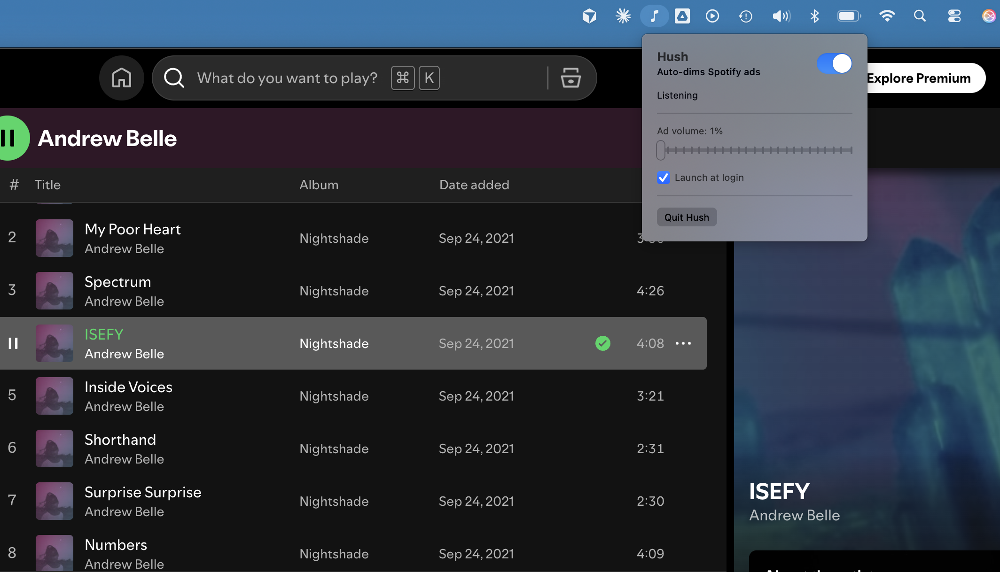
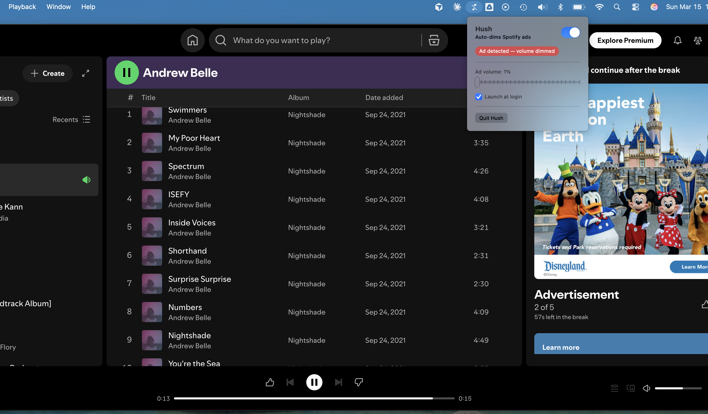

# Hush

A lightweight macOS menu bar app that automatically reduces system volume when Spotify plays ads, then restores it when music resumes.

| Listening | Ad detected |
|:-:|:-:|
|  |  |

## Why?

Spotify Free inserts audio ads between songs. You can't skip them, and muting doesn't work — Spotify detects it and pauses playback. Hush works around this by *reducing* (not muting) the volume to a near-silent floor, then smoothly fading it back up when your music returns.

## Install

**Requirements:** macOS 13 (Ventura) or later

### Download

1. Download `Hush.app.zip` from the [latest release](https://github.com/enflory/hush/releases/latest)
2. Unzip and drag `Hush.app` to `/Applications`
3. Launch Hush — macOS will show an **"Hush Not Opened"** warning (the app is ad-hoc signed, not notarized, since I don't have an Apple Developer account)
4. Click **Done**, then go to **System Settings → Privacy & Security**, scroll down to the *"Hush" was blocked* message, and click **Open Anyway**
5. This is a one-time step — after that, Hush launches normally and a music note icon will appear in your menu bar

### Build from source

Requires [Xcode Command Line Tools](https://developer.apple.com/xcode/resources/).

```bash
git clone https://github.com/enflory/hush.git
cd hush
make install
```

This builds `Hush.app` and copies it to `/Applications`.

### First launch

On first launch, macOS will ask you to grant Hush permission to control System Events and Spotify. Accept both prompts — these are needed for AppleScript-based metadata polling.

### Uninstall

Drag `Hush.app` from `/Applications` to the trash. To also remove preferences:

```bash
defaults delete com.hush.app
```

## How It Works

Hush polls Spotify metadata via AppleScript every 2 seconds. When Spotify switches from music to an advertisement (detected by `spotify:ad:` URL prefix or metadata patterns), the system volume is immediately reduced to a configurable floor level (default 5%). When music resumes, volume fades back to the previous level over ~1 second.

Volume is reduced, not muted, because Spotify detects muting and pauses playback.

## Settings

Click the music note icon in the menu bar to access:

- **On/Off toggle** — Enable or disable ad detection
- **Ad volume slider** — Set how quiet ads should be (1%–25%)
- **Launch at login** — Start Hush automatically when you log in

## Development

```bash
swift build              # Build all targets
swift run Hush           # Run without installing
swift test               # Run all tests (20)
make app                 # Build Hush.app bundle
make install             # Build and copy to /Applications
make clean               # Remove build/ directory
make icon                # Regenerate app icon from SF Symbol
```

### Architecture

Two SPM targets: **HushCore** (library — all business logic) and **Hush** (executable — SwiftUI entry point). Tests import HushCore.

```
AppleScript polling → MediaMonitor → AdClassifier → MonitorState → VolumeController
```

```
Sources/
  HushCore/           # Library target (all business logic)
    AdClassifier.swift        # Protocol for ad detection
    SpotifyAdClassifier.swift # Spotify-specific ad detection
    MonitorState.swift        # State machine (idle/normal/dimmed)
    VolumeController.swift    # CoreAudio volume get/set/fade
    MediaRemoteBridge.swift   # AppleScript bridge to Spotify
    MediaMonitor.swift        # Orchestrator
    AppState.swift            # Settings + observable state
    NowPlayingMetadata.swift  # Metadata model
  Hush/               # Executable target (SwiftUI app)
    HushApp.swift             # Menu bar entry point
    SettingsView.swift        # Popover UI
Resources/
  Info.plist                  # App bundle metadata
  AppIcon.icns                # App icon
scripts/
  build-app.sh                # Assembles and codesigns .app bundle
  generate-icon.swift         # Generates AppIcon.icns from SF Symbol
Tests/
  HushTests/          # Swift Testing unit tests
```

## Contributing

Contributions are welcome! Please open an issue first to discuss what you'd like to change.

1. Fork the repo
2. Create a feature branch (`git checkout -b my-feature`)
3. Make your changes and add tests where applicable
4. Run `swift test` to verify all tests pass
5. Open a pull request

## License

[MIT](LICENSE)
